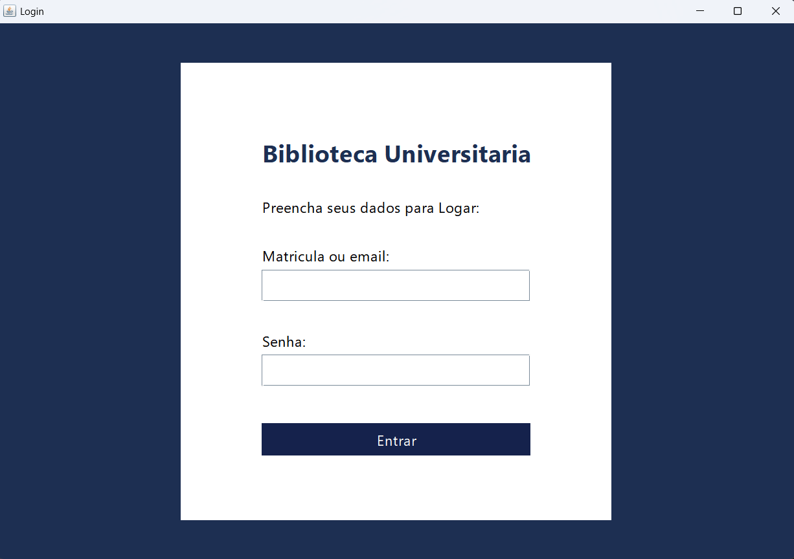

# Biblioteca Universitária – Sistema de Gerenciamento de Empréstimos e Acervo

> Plataforma completa para gerenciamento de livros, alunos, empréstimos e devoluções no ambiente acadêmico.

O **Biblioteca Universitária** é um sistema desenvolvido em **Java + Swing + JDBC + MySQL**, criado com o objetivo de oferecer uma solução simples e funcional para gestão de acervo, controle de usuários e administração de empréstimos. Este projeto foi criado como entrega acadêmica da disciplina de Ambiente de Dados.

<p align="center">
  
</p>

---

## Tecnologias Utilizadas
O sistema foi desenvolvido utilizando **Java + Swing** para a interface gráfica e **JDBC + MySQL** para o acesso ao banco de dados, seguindo uma arquitetura modular focada em organização e manutenção.

[![Java][Java-badge]][Java-url]
[![Swing][Swing-badge]][Swing-url]
[![JDBC][JDBC-badge]][JDBC-url]
[![MySQL][MySQL.com]][MySQL-url]

---

## Pré-requisitos

Antes de iniciar o projeto, certifique-se de que o seu ambiente atende aos seguintes requisitos:

- **Java JDK 17 ou superior**  
  Verifique sua versão com:
  ```
  java -version
  ```

- **MySQL Server 8+**

- **MySQL Workbench**

- **Git instalado** (recomendado para clonar o repositório; você também pode apenas baixar o aquivo em formato .zip do projeto e abrir no seu editor de código)

- **IntelliJ IDEA / NetBeans / VSCode com Extensão Java**  

> [!NOTE]  
> Para que o projeto funcione corretamente, também é necessário criar o banco de dados. Esse procedimento será explicado na próxima seção.

---

## Instalação e Execução do Projeto

Siga os passos abaixo para instalar, configurar e executar o sistema Biblioteca Universitária no seu computador.


### 1. Clonar o repositório

Abra o terminal (CMD, PowerShell ou Bash) e execute:

```
git clone https://github.com/abeatrizsm/BibliotecaUniversitaria.git
```

Entre na pasta do projeto:

```
cd BibliotecaUniversitaria
```

---

### 2. Configurar o Banco de Dados

> Certifique-se de que o MySQL Server está instalado e ativo.

1. Abra o **MySQL Workbench**
2. Vá até a pasta `/database` do projeto
3. Abra o arquivo `Script_Biblioteca.sql`
4. Execute todo o script no icone de raio, isso criará todas as tabelas necessárias e inserirá dados iniciais

---

### 3. Configurar o Projeto Java

1. Abra o projeto na sua IDE
2. Certifique-se de que o driver **MySQL Connector/J** está disponível na pasta `lib/` ou no classpath
3. Abra o arquivo responsável pela conexão,  `ConexaoDAO.java`, e configure seus dados:

```java
 conn = DriverManager.getConnection("jdbc:mysql://localhost:3306/BibliotecaUniversitaria", "root", "sua_senha");
```
---

### 4. Executar o sistema

Após configurar o banco e ajustar a conexão JDBC, execute o sistema:

```
Run > Run Project
```

Após isso o sistema deve abrir e funcionar normalmente. Os logins e senhas cadastrados estão na tabela "usuário". Rode o comando select * from usuarios para visualizar os dados mais facilmente e entre com qualquer cadastro para testar.

> [!IMPORTANT]  
> A diferenciação entre aluno e bibliotecário é feita pelo atributo **"tipo"** na tabela de usuários. Portanto, ao realizar o login, certifique-se de utilizar uma conta compatível com o perfil que deseja acessar.

---

## Autora

Ana Beatriz Silveira Mendes  
4º Semestre – Ciência da Computação  

---

## Licença

Projeto produzido exclusivamente para fins acadêmicos.

---

<!-- BADGES -->

[Java-badge]: https://img.shields.io/badge/Java-ED8B00?style=for-the-badge&logo=openjdk&logoColor=white
[Java-url]: https://www.oracle.com/java/

[Swing-badge]: https://img.shields.io/badge/Java%20Swing-5382a1?style=for-the-badge
[Swing-url]: https://docs.oracle.com/javase/tutorial/uiswing/

[JDBC-badge]: https://img.shields.io/badge/JDBC-007396?style=for-the-badge
[JDBC-url]: https://docs.oracle.com/javase/8/docs/technotes/guides/jdbc/

[MySQL.com]: https://img.shields.io/badge/MySQL-005C84?style=for-the-badge&logo=mysql&logoColor=white
[MySQL-url]: https://www.mysql.com/
